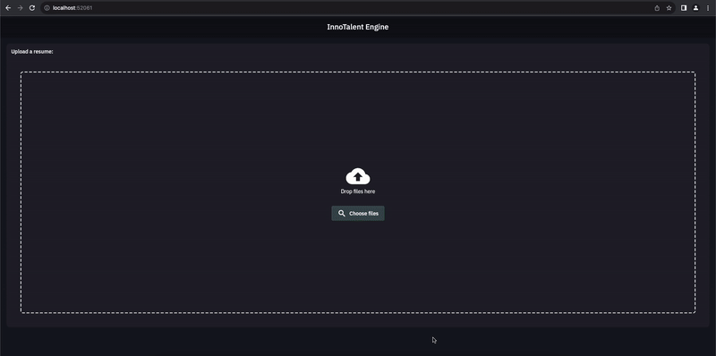

# InnoTalent Engine Frontend


InnoTalent Engine Frontend is the frontend Flutter application for InnoTalent API which is designed to streamline the hiring process for companies. By calling the backend that integrates with five AI models, including one from **OpenAI** and **four custom AI models**, this frontend Flutter Web App provides a means for user to:

* Upload resume to be processed by the backend
* View predicted insights returned by the backend

<br>

The upload page allows the user to upload a file by drag and drop or picking a file from local filesystem:

<br>

After the user picked a file, a preview on the file name, file size and file type is shown:

<br>

The dashboard on the frontend presents the predicted score in an intuitive dashboard that provides actionable insights for HR to determine if a candidate is the right fit for the company.

<br>

## UI Flow

<br/>

## InnoTalent Engine Components
* [Frontend](https://github.com/junsiong2008/innotalent-frontend.git)
* [Backend API](https://github.com/LeeChongKeat/API_InnoTalent_Engine)
* [Employee Rating AI](https://github.com/LeeChongKeat/Employee_Personal_Rating_Prediction)
* [Resignation Intention AI](https://github.com/LeeChongKeat/Resignation_Intention_Prediction)
* [Salary AI](https://github.com/LeeChongKeat/Salary_Prediction)
* [Work Performance (Return on Work)](https://github.com/LeeChongKeat/Work_Performance_Prediction) 
<br/>

## Business Model
InnoTalent Engine offers a pioneering and  first-to-market solution for the HR hiring process.
It provides a customer-fit dashboard for HR to conduct a comprehensive 360° analysis and generate actionable insights for HR to hire the right talent. 
InnoTalent allows the customization of parameters based on company policies to pinpoint the right talent.

Free Features for Everyone:
1) Companies can freely use InnoTalent to analyze talent resumes.

Premium Users:
2) Access to detailed job history, records, and provisional job data of the talent.

How it make Money:
1) Premium User Subscriptions
2) Utilization of Talent Data to train and improve our AI model, continuously enhancing accuracy and effectiveness.
<br/>

## Pre-requisites
This project uses the following SDKs:
```
sdk: '>=2.19.5 <3.0.0'
```

Additional information about the Flutter packages used could be found in `pubspec.yaml`.

<br/>

## Features
- **AI Integration**: Integration with a Python backend for prediction and analysis services.
- **Easy Upload**: Allows candidates to upload their resumes by dragging and dropping or selecting from file system.
- **Intuitive Dashboard**: Insights on dashboard is easy to understand and can be translated to action items to attract new talent and retain existing talent.
<br/>

## How it Works
1. **Upload Resume**
2. **AI Analysis**
3. **Evaluation**
4. **Overall Score**
5. **Provide Next Action Insight**
<br/>

## Benefits
- **Smart Decision-Making**: Make data-driven decisions by leveraging AI insights for candidate evaluation.
- **Cost-Efficiency**: Reduce costs associated with manual resume screening and optimize the hiring process.
- **Enhanced Hiring**: Identify and hire candidates who align with the organization's requirements and values.
- **Improved Productivity**: Focus on interviewing candidates who are more likely to contribute positively to the company.
<br/>

## Folder Structure
The source code of the project is organized in the `lib` directory with the following structure:
```

- models/
    |
    * pre_rating.dart
    * selected_file.dart
    * talent_stat.dart

- pages/
    |
    * reports/
        |
        * widgets/
            |
            * header_widget.dart
            * rating_spider_chart_card.dart
            * resignation_probability_line_graph.dart
            * return_bar_chart_card.dart
            * talent_graph_card.dart
            * talent_metric_card.dart
            * talent_summary_card.dart
        * report_page.dart
        * dashboard.dart

    * upload/
        |
        * widgets/
            |
            * dropzone_widget.dart
            * file_preview_widget.dart
            * loading_widget.dart
            * upload_card.dart
        * upload_main.dart
        * upload_page.dart
    
    * services/
        |
        * innotalent_service.dart
    
    * utils/
        |
        * role_util.dart
    
    * widgets/
        |
        * custom_card.dart
        * responsive.dart

- const.dart
- main.dart
        

```

<br/>

## Running the project locally
Follow the steps below to run the project on your localhost:
1. Clone the project in a local directory:
    ```
    git clone https://github.com/junsiong2008/innotalent-frontend.git
    ```
2. Navigate to project directory:
    ```
    cd innotalent-frontend
    ```

3. Get the Flutter packages:
    ```
    flutter pub get
    ```

4. Run the web application 🎉:
    ```
    flutter run
    ```

<br/>


## DevHack 2023 Google Developer Groups George Town
Team: (3A)th Industrial

Member 1 : Ts. Lee Chong Keat jerry_keat@hotmail.com

Member 2 : Teng Jun Siong junsiong2599@gmail.com

Member 3 : Teoh Chun Keat chunkeatteoh99@gmail.com


